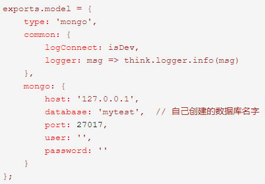

# Day2

### 参考

##### thinkjs框架

https://thinkjs.org/doc/index.html

# 后端服务

### 框架选择

- python + Thinkjs + mongodb
- python + flask + mongodb

## A 搭建一个后端项目

------

### Thinkjs

#### 安装环境

- 安装Node.js

  - 下载地址： https://nodejs.org/zh-cn/
        （选择LTS版）

- 验证下载  

  - 在终端下 查询版本号

  ```
      $ node -v
     
      $ npm -v
  ```

- 安装Thinkjs框架

  ```
      $ npm install -g think-cil
  ```

  - 验证下载

    - 查看think-cil版本号

      `thinkjs -V`

    - 若是从2.x升级，需将thinkjs删除后重新下载

      `$ npm uninstall -g thinkjs`

#### 创建项目

- 在项目目录的终端下创建项目

  ```
      $ thinkjs new [project_name];
  ```

  - 第一句执行后有四个问题  回车即默认
  - 执行后 关闭终端 再重新打开终端进行下一步

  ```
      $ cd [project_name];
  
      $ npm install;
      
      $ npm start;   
  ```

  - 执行完成后，会在控制台下看见类似日志

    

  - 验证创建完成

    - 访问 https://127.0.0.1:8360/
      - 若在远程主机上创建的项目，把ip地址换成对应地址

  - Thinkjs框架默认项目结构

    

------

### flask

- 为了操作方便，使用pycharm

#### 安装下载

- 安装flask连接mongodb专用包工具

  `pip install flask_pymongo`

- 导入相关包

  ```
      from flask import Flask,render_template
      # 导入轻量化的web框架flask
  
      from flask_pymongo import PyMongo
      # 导入第三方包flask_pymongo,连接mongodb
  ```

#### 启动程序

```
        if name == 'main':
            app.run(debug = True)
```

------

## B 实现后端项目与mongodb连接

------

### Thinkjs

#### 让框架支持mongdb

- 安装 ***think-mongo*** 模块

  `$ npm install think-mongo`

- 在项目的 ***config*** 目录下的 ***extend.js*** 文件中添加 ***think-mongo*** 模块

  ```
      const mongo = require('think-mongo');
  
      module.exports = [
          mongo(think.app)
      ]
  ```

#### 创建mongodb

- 在项目 ***根目录*** 下新建 ***db*** 目录，用于存放数据

  `mkdir db`

- 开启服务

  ```
      cd db
  
      mongod --dbpath=./
  ```

  - 以后也要在此目录下开启服务，否则后台连接不上服务器

#### 连接mongodb

- 修改 ***config*** 目录下的 ***adapter.js*** 文件

  

------

### flask

#### 配置环境

```
​```
    app = Flask(__name__)
    app.config['MONGO_URI'] = "mongodb://127.0.0.1:27017/db_name"
    # 实例化数据库配置，可以直接一行解决
​```
```

#### 实例化数据库

```
​```
    mongo = PyMongo(app)
​```
```

------

## C 通过后端实现对mongodb的CURD操作

------

### Thinkjs

#### 添加路由

- 在 ***controller*** 目录下

##### 修改初始页面

- ***index.js*** 文件 修改返回值

  ```
      module.exports = class extends Base {
          indexAction() {
              return this.display();
          }
      };
  ```

#### thinkjs 对 mongdb 的 CURD

https://thinkjs.org/zh-cn/doc/2.2/model_crud.html

#### thinkjs 特定 CURD 封装

https://thinkjs.org/zh-cn/doc/2.2/model_intro.html#toc-d84

- 在 ***controller*** 同级创建 ***model*** 目录 

  - 目录下 xx.js 即为 xx模型

  ```
      module.exports = class extends think.Mongo {
          aaa() {
              return this.model('user').select();
          };
      }
  ```

- 在 ***controller*** 下创建 ***xxx.js*** 

  - 即创建一个控制器

    ```
        const Base = require('./base.js');
    
        module.exports = class extends Base {
            async indexAction() {
                // controller 中实例化模型 并调用自定义方法
                const user = await this.mongo('user').aaa();
                if (think.isEmpty(user)) {
                    return this.fail();
                } else {
                    return this.success(user);
                }
            }
        };
    ```

------

### flask

#### 添加路由

- 添加根页面api

  ```
      @app.route('/') # 路由 根目录
      def index():    
          # 测试数据库是否连接成功，如果成功就会返回Pymongo⼀一个游标对象。    
          onlines_users = mongo.db.system.users.find()
          word = '连接成功～'    
          return render_template('index.html')
   
  ```

#### flask 对 mongo 的 CURD

- 增

  ```
      @app.route('/add')
      def add():
          user = mongo.db.users
          username = "swper12222"
          userusername = user.find_one({"username":username})    
          if  userusername:        
              return "⽤用户已经存在！"    
          else:
              user.insert({"username": username, "password": "123456"})
              return "Added User!"
  
  ```

- 删

  ```
      @app.route('/delete/<username>')
      def delete(username):
          user = mongo.db.users    
          userusername = user.find_one({"username":username})    
          user.remove(userusername)    
          if userusername:        
              return "Remove " + userusername["username"] + " Ok!"    
          else:
              return "用户不不存在，请核对后再操作!"
  
  
  ```

- 改

  ```
      @app.route('/update/<username>')
      def update(username):
          user = mongo.db.users
          passwd = "abcd10023"
          userusername = user.find_one({"username":username})
          userusername["password"] = passwd
          user.save(userusername)
          return "Update OK " + userusername["username"]
  
  
  ```

- 查

  ```
      @app.route('/find/<username>')
      def find(username):
          user = mongo.db.users
          userusername = user.find_one({"username":username})
          if userusername:
              return "你查找的用户名：" + userusername["username"] + " 密码是：" + userusername["password"]    
          else:        
              return "你查找的⽤用户并不不存在!"
  
  ```

------

------

# 物流模拟

## D 编写地理信息存储Api

​    

## E 使用小程序获取地理位置的Api

## F 小程序中整合二维码扫描功能

## G 生成一个二维码保存自己的信息（姓名、学号等）扫码后发送post请求保存这些数据

## H 后端对个人信息数据进行接收，存储到数据库中

------

### Thinkjs 

#### 创建控制器

- 在 ***controller*** 目录下 创建 相应 ***xxx.js*** 文件
  - 自定义文件内容

------

# Day 4


## a.设计二维码

## 参阅

https://cli.im/ - 草料二维码


## b.获取位置信息

## 目标

1. 完成对地图接口的调用，返回相关的调用结果

## 实现介绍

> 本实例中使用高德地图的API https://lbs.amap.com/

有关小程序调用 API 部分，请参考官方文档 https://lbs.amap.com/api/wx/summary/

本案例使用高德地图 API 获取经纬度

在页面加载函数 onLoad 中实例化 AMapWX 对象

调用 getPoiAround 方法， 获取 POI 数据

在 success 回调函数中把**经纬度**添加到全局变量中


## c.扫描获取二维码中的信息

## 目标

1. 在小程序中使用扫描获取二维码包含的信息
2. 将获取的二维码信息和位置信息发送给后端

## 实现介绍

使用 `wx.scanCode` 方法调起客户端扫码界面进行扫码

| 属性名  |          含义          |
| :-----: | :--------------------: |
| success | 接口调用成功的回调函数 |
|  fail   | 接口调用失败的回调函数 |

`success` 的回调函数中，包含返回结果 `res`  。

`res` Object 属性

| 属性名 |     含义     |
| :----: | :----------: |
| result | 所扫码的内容 |

定义一个全局列表变量 `allresult : ` ' '

获取到二维码信息后，将它与位置信息一起添加到 `allresult` 

扫码成功后发起请求，在 `wx.scanCode` 的  `success` 回调函数内添加 `wx.request` 方法

通过 `wx.request` 方法发起 POST 请求

将数据传给后端统一保存


## d.后端接收保存数据

## 目标

1. 接收前端发送的数据请求
2. 将数据保存在数据库中

## 实现介绍

1. 创建相应数据库（mongoDB）

   > 这里创建数据库与集合用来存储前端传回的信息

```
use weather
db.createCollection("user")
```

2. 设计接口（后端使用 ThinkJS 实现）

   test.js

   ```
   const Base = require("./base.js");
   
   module.exports = class extends Base {
       async indexAction() {
               const data = this.post('data');
               console.log(data)
               const a = await this.mongo('user').add(data);
               console.log(a);
               return this.success('success');
       }
   
       async addAction() {
               const test = 'hahaha';
               return this.json({test});
       }
   };
   
   ```

   3.效果图（数据库中前端发送的数据）

   

**代码样例：**

[index.js](https://github.com/xpcloud/map-miniprogram/blob/master/pages/index/index.js)


