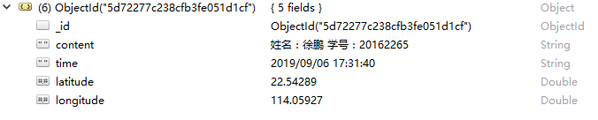

# 后端对个人信息数据进行接收，存储到数据库中

### thinkjs 

+ 实现代码

    ```
        const Base = require("./base.js");

        module.exports = class extends Base {
            async indexAction() {
                    const data = this.post('data');
                    console.log(data)
                    const a = await this.mongo('temperature').add(data);
                    console.log(a);
                    return this.success('success');
            }

            async addAction() {
                    const test = 'hahaha';
                    return this.json({test});
            }
        };
    ```

+ 数据库

