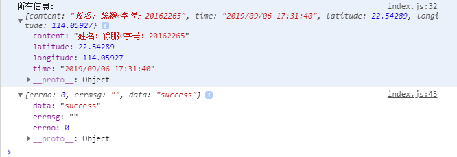

# 扫码后 将数据post给后端

###  实现代码

+ 配置

```
    var amapFile = require('../../libs/amap-wx.js');
    var util = require('../../utils/util.js');
    var markersData = [];
    Page({
        data: {
            markers: [],
            latitude: '',
            longitude: '',
            textData: {},
            allresult: '',
            smileImage: []
        },
    })
```

+ 扫码并post

```
    scan: function() {
        var that = this;
        wx.scanCode({
            success(res) {
                console.log("扫码成功的信息：", res)

                //获取系统时间
                var time = util.formatTime(new Date())
                that.setData({
                    time: time
                })

                //设置一个allresult来接受所有的数据
                let allresult = {};
                allresult["content"] = res.result;
                allresult["time"] = time;
                allresult["latitude"] = that.data.latitude;
                allresult["longitude"] = that.data.longitude;
                console.log("所有信息：", allresult)
                that.setData({
                    allresult: allresult
                })

                //发起请求
                wx.request({
                    url: 'http://127.0.0.1:8360/test/index',
                    method: 'POST',
                    data: {
                        data: that.data.allresult
                    },
                    success: function(res) {
                        console.log(res.data)
                    }
                })
            }
        })
```

+ 扫码返回值 post回调


