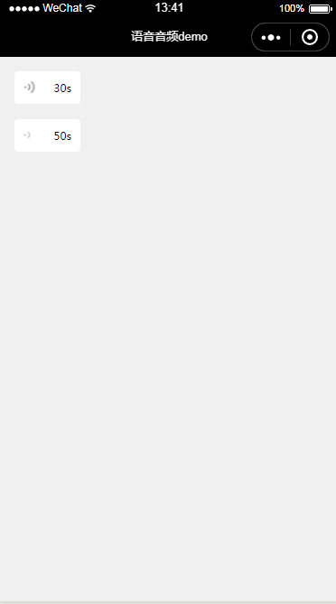

## 类似于微信语音聊天时的效果

### wxml结构

```
<block wx:for="{{audioArr}}" wx:key="content" wx:for-item="v" wx:for-index="key">
  <view class='output-audio'>

    <!-- 默认状态 -->
    <view class='audio' wx:if="{{v.bl==false}}" bindtap='audioPlay' data-key="{{key}}" data-id="{{v.id}}" data-bl="{{v.bl}}">
      <image class='ico' src='https://xcx.quan5fen.com/Public/xcx-hitui/image/imgs-jyh/yuyin-ico.png' />
      <label class='time'>{{v.time}}</label>
    </view>

    <!-- 当前正在播放状态 -->
    <view class='audio' wx:if="{{v.bl==true}}" bindtap='audioStop' data-key="{{key}}"  data-id="{{v.id}}" data-bl="{{v.bl}}">
      <image class='ico' src='https://xcx.quan5fen.com/Public/xcx-hitui/image/imgs-jyh/yuyin-gif.gif' />
      <label class='time'>{{v.time}}</label>
    </view>

  </view>
</block>
```
### wxss样式

```
page{ background: #f0f0f0;}
.output-audio{ width: 150rpx; margin: 30rpx; }
.output-audio .audio{  padding: 20rpx; border-radius: 10rpx;background-color: #fff;
border: 1px solid #f0f0f0; overflow: hidden; }
.output-audio .audio .ico{ width: 26rpx; height: 30rpx; float: left;}
.output-audio .audio .time{ float: right; font-size: 24rpx;}
```
### .js方法

```
// pages/audio/audio.js

//创建audio控件
const myaudio = wx.createInnerAudioContext(); 

Page({

  /**
   * 页面的初始数据
   */
  data: {

    //音频列表
    audioArr: [
      {
        id: '000',
        src: 'https://s320.xiami.net/928/19928/1882512413/1772277226_1513175794617.mp3?ccode=xiami_web_web&expire=86400&duration=182&psid=485902a766977ecaae347a4cc851e8da&ups_client_netip=113.70.219.174&ups_ts=1551680441&ups_userid=0&utid=ljH9FKf0Um0CAQ7fs+HVAPRw&vid=1772277226&fn=1772277226_1513175794617.mp3&vkey=Bac0e9fde3983f090cef0a37e1cb73ef7',
        time: '30s',
        bl: false
      },
      {
        id: '001',
        src: 'https://s128.xiami.net/764/33764/2104642547/1810384080_1551417116476_5598.mp3?ccode=xiami_web_web&expire=86400&duration=181&psid=6320a01db73a6fdb9632f5800fc93fe5&ups_client_netip=113.70.219.174&ups_ts=1551680537&ups_userid=0&utid=ljH9FKf0Um0CAQ7fs+HVAPRw&vid=1810384080&fn=1810384080_1551417116476_5598.mp3&vkey=B54b264178201f6737c9bb5ff4bbce3d0',
        time: '50s',
        bl: false
      },
    ]
  },


  //音频播放  
  audioPlay: function (e) {
    var that = this,
      id = e.currentTarget.dataset.id,
      key = e.currentTarget.dataset.key,
      audioArr = that.data.audioArr,
      vidSrc = audioArr[key].src;
    myaudio.src = vidSrc;
    myaudio.autoplay = true;

    //切换显示状态
    for (var i = 0; i < audioArr.length; i++) {
      audioArr[i].bl = false;
    }
    audioArr[key].bl = true;
    
   myaudio.play();
   
    //开始监听
    myaudio.onPlay(() => {
      that.setData({
        audioArr: audioArr
      })
    })

    //结束监听
    myaudio.onEnded(() => {
      audioArr[key].bl = false;
      that.setData({
        audioArr: audioArr,
      })
    })

  },

  // 音频停止
  audioStop: function (e) {
    var that = this,
      key = e.currentTarget.dataset.key,
      audioArr = that.data.audioArr;
    //切换显示状态
    for (var i = 0; i < audioArr.length; i++) {
      audioArr[i].bl = false;
    }
    audioArr[key].bl = false;

    myaudio.stop();
    //停止监听
    myaudio.onStop(() => {
      audioArr[key].bl = false;
      that.setData({
        audioArr: audioArr,
      })
    })
    //结束监听
    myaudio.onEnded(() => {
      audioArr[key].bl = false;
      that.setData({
        audioArr: audioArr,
      })
    })
  }, 

  /**
   * 生命周期函数--监听页面加载
   */
  onLoad: function (options) {

  },

  /**
   * 生命周期函数--监听页面初次渲染完成
   */
  onReady: function () {

  },

  /**
   * 生命周期函数--监听页面显示
   */
  onShow: function () {

  },

  /**
   * 生命周期函数--监听页面隐藏
   */
  onHide: function () {
  
  },

  /**
   * 生命周期函数--监听页面卸载
   */
  onUnload: function () {
  
  },

  /**
   * 页面相关事件处理函数--监听用户下拉动作
   */
  onPullDownRefresh: function () {
  
  },

  /**
   * 页面上拉触底事件的处理函数
   */
  onReachBottom: function () {
  
  },

  /**
   * 用户点击右上角分享
   */
  onShareAppMessage: function () {
  
  }
})
```

### 效果图


