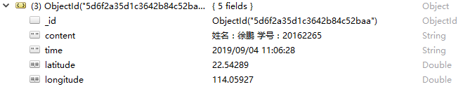

# 后端接收保存数据

### 1. 目标

#### 1.1. 接收前端发送的数据请求
#### 1.2. 将数据保存在数据库中

### 2. 实现介绍

#### 2.1. 创建相应数据库（mongoDB）

   > 这里创建数据库与集合用来存储前端传回的信息

```
use weather
db.createCollection("user")
```

#### 2.2. 设计接口（后端使用 ThinkJS 实现）

   test.js

   ```
   const Base = require("./base.js");
   
   module.exports = class extends Base {
       async indexAction() {
               const data = this.post('data');
               console.log(data)
               const a = await this.mongo('user').add(data);
               console.log(a);
               return this.success('success');
       }
   
       async addAction() {
               const test = 'hahaha';
               return this.json({test});
       }
   };
   
   ```

#### 2.3. 效果图（数据库中前端发送的数据）

   
