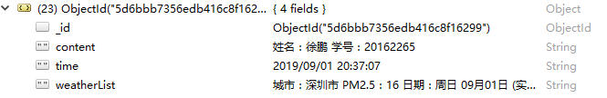

# part 4


## a.设计二维码

## 参阅

https://cli.im/ - 草料二维码


## b.获取位置信息

## 目标

1. 完成对地图接口的调用，返回相关的调用结果

## 实现介绍

> 本实例中使用百度地图的API http://lbsyun.baidu.com/

有关小程序调用 API 部分，请参考官方文档 http://lbsyun.baidu.com/index.php?title=wxjsapi

本实例中使用了天气查询功能

添加给定的代码到小程序中，返回一串json格式的值给客户端

```
{weatherData: "城市：深圳市
 			  PM2.5：27
 			  日期：周二 09月03日 (实时：29℃)
 			  温度：31 ~ 26℃
 			  天气：阵雨
 			  风力：无持续风向微风", 
 allresult: "", 
 __webviewId__: 0}
```


## c.扫描获取二维码中的信息

## 目标

1. 在小程序中使用扫描获取二维码包含的信息
2. 将获取的二维码信息和位置信息发送给后端

## 实现介绍

使用 `wx.scanCode` 方法调起客户端扫码界面进行扫码

| 属性名  |          含义          |
| :-----: | :--------------------: |
| success | 接口调用成功的回调函数 |
|  fail   | 接口调用失败的回调函数 |

`success` 的回调函数中，包含返回结果 `res`  。

`res` Object 属性

| 属性名 |     含义     |
| :----: | :----------: |
| result | 所扫码的内容 |

获取到二维码信息后，定义一个全局列表变量 `allresult : {}`

将它与位置信息一起添加到 `allresult` 

扫码成功后发起请求，在 `wx.scanCode` 的  `success` 回调函数内添加 `wx.request` 方法

通过 `wx.request` 方法发起 POST 请求

将数据传给后端统一保存


## d.后端接收保存数据

## 目标

1. 接收前端发送的数据请求
2. 将数据保存在数据库中

## 实现介绍

1. 创建相应数据库（mongoDB）

   > 这里创建数据库与集合用来存储前端传回的信息

```
use weather
db.createCollection("user")
```

2. 设计接口（后端使用 ThinkJS 实现）

   test.js

   ```
   const Base = require("./base.js");
   
   module.exports = class extends Base {
       async indexAction() {
               const data = this.post('data');
               console.log(data)
               const a = await this.mongo('user').add(data);
               console.log(a);
               return this.success('success');
       }
   
       async addAction() {
               const test = 'hahaha';
               return this.json({test});
       }
   };
   
   ```

   3.效果图（数据库中前端发送的数据）

   

**代码样例：**

[index.js](https://github.com/xpcloud/baidu-map-miniprogramer/blob/master/pages/index/index.js)


调用百度地图 `API` 来获取位置信息


